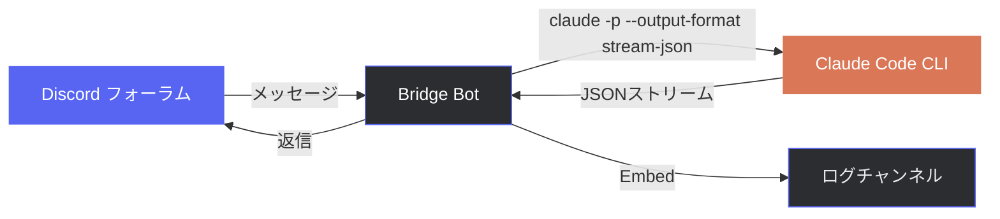
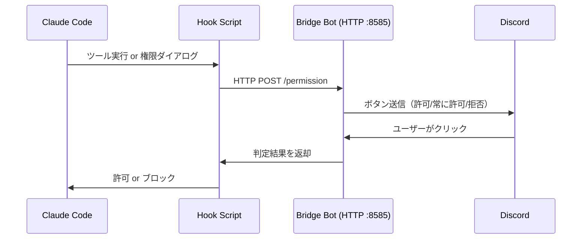

<div align="center">

**日本語** | [English](README_en.md) | [中文](README_zh.md)

# Discord Claude Bridge

### Discordフォーラム × Claude Code CLI

[](https://www.python.org/)
[](https://discord.com/developers/docs/intro)
[](https://docs.anthropic.com/en/docs/claude-code)
[](LICENSE)

**Discordのフォーラムスレッドがそのまま Claude Code の会話セッションに。**

---

</div>

## 概要

Discord のフォーラムチャンネルに投稿するだけで、サーバー上の [Claude Code](https://docs.anthropic.com/en/docs/claude-code) CLI が実行されるブリッジBotです。スレッドごとにセッションが管理され、会話の文脈を維持したまま継続的にやり取りできます。



## 特徴

| 機能 | 説明 |
|:---:|---|
| **セッション管理** | スレッドごとにClaude Codeセッションを自動管理。`--resume` で会話を継続 |
| **セッション引き継ぎ** | PCのClaude CodeセッションをスラッシュコマンドでDiscordに引き継ぎ |
| **プロジェクトディレクトリ自動解決** | セッションの作業ディレクトリ（cwd）を自動検出して実行 |
| **Discord権限承認** | Claude Codeのツール実行前にDiscordボタンで許可/拒否を選択可能 |
| **画像対応** | 添付画像の送受信に対応。スクリーンショットを送って分析も可能 |
| **タグ自動更新** | `実行中` / `完了` / `エラー` タグがリアルタイムで切り替わる |
| **実行ログ** | 全実行のプロンプト・応答・ステータスをEmbed形式で別チャンネルに記録 |
| **タイムアウト制御** | 10分で進捗通知、1時間で強制終了。長時間タスクも安心 |
| **メッセージ分割** | 2000文字超の応答をコードブロックを壊さずに自動分割 |
| **アクセス制御** | 許可されたユーザーIDのみ実行可能 |

## 必要なもの

- **Python 3.11+**
- **[Claude Code CLI](https://docs.anthropic.com/en/docs/claude-code)** — `claude` コマンドがPATHに通っていること
- **Discord Bot** — Message Content Intent が有効なBotトークン

## インストール

### 1. インストール

```bash
git clone https://github.com/cUDGk/discord-claude-bridge.git
cd discord-claude-bridge
pip install -r requirements.txt
```

### 2. 設定

```bash
cp .env.example .env
```

`.env` を編集して以下を設定：

| 変数名 | 説明 |
|---|---|
| `DISCORD_TOKEN` | Discord Botのトークン（必須） |
| `ALLOWED_USERS` | 実行を許可するユーザーID（カンマ区切り） |
| `FORUM_CHANNEL_ID` | プロンプトを受け付けるフォーラムチャンネルのID（必須） |
| `LOG_CHANNEL_ID` | 実行ログを送信するチャンネルのID（`0` で無効） |
| `GUILD_ID` | BotがいるサーバーのID（`0` で全ギルド対応） |
| `SKIP_PERMISSIONS` | `true` で全操作を自動許可（デフォルト: `false`） |
| `HOOK_PORT` | 権限リクエスト用の内部ポート（デフォルト: `8585`） |
| `CLAUDE_BIN` | `claude` 実行ファイル名/絶対パス（デフォルト: `claude`） |
| `PERMISSION_MODE` | `--permission-mode` 値（`acceptEdits` / `plan` / `auto` / `bypassPermissions` / 空） |
| `MAX_TURNS` | 1ターンの最大エージェント実行回数（空で無制限） |
| `MAX_BUDGET_USD` | 1ターンの最大コスト USD（空で無制限） |
| `SOFT_TIMEOUT` / `HARD_TIMEOUT` | 進捗通知 / 強制終了の秒数（既定 600 / 3600） |
| `MAX_CONCURRENT_RUNS` | スレッド単位の並列実行上限（既定 5） |

### 3. Discord Botの準備

1. [Discord Developer Portal](https://discord.com/developers/applications) でBotを作成
2. **Privileged Gateway Intents** → **Message Content Intent** を有効化
3. 必要な権限でBotをサーバーに招待：
   - `Send Messages` / `Manage Threads` / `Read Message History` / `Embed Links`
4. フォーラムチャンネルとログ用テキストチャンネルを作成

### 4. 起動

```bash
python bot.py
```

## 使い方

### 基本的な使い方

```
1. フォーラムチャンネルにスレッドを作成
2. スレッド内にメッセージを投稿（画像添付も可）
3. Bot が Claude Code を実行して返信
4. 同じスレッド内で会話を継続
```

> スレッドタイトルは新規セッション時のコンテキストとして自動的に付加されます。

### スラッシュコマンド

| コマンド | 説明 |
|---|---|
| `/help` | コマンド一覧を表示 |
| `/sessions [件数]` | PCのClaude Codeセッション一覧を表示（デフォルト10件、最大20件） |
| `/resume <session_id> [title] [prompt]` | 指定セッションをDiscordに引き継ぎ |
| `/resume-latest [title] [prompt]` | 最新セッションをワンクリックで引き継ぎ |

### プレフィックスコマンド

| コマンド | 説明 |
|---|---|
| `!sync` | スラッシュコマンドをDiscordに同期（コマンド追加・変更後に1回実行） |

## 権限モード

`SKIP_PERMISSIONS=false`（デフォルト）の場合、Claude Code がファイル編集やコマンド実行などのツールを使おうとすると、Discordスレッドにボタンが表示されます。



3つのフックで全ての確認・通知をカバーします：

| フック | 発火タイミング |
|:---:|---|
| **PreToolUse** | 全ツール実行前。読み取り専用ツールは自動許可。`AskUserQuestion` は選択肢ボタンに変換 |
| **PermissionRequest** | Claude Codeの権限確認ダイアログ表示時 |
| **Notification** | `permission_prompt` / `idle_prompt` / `elicitation_*` などの通知を該当スレッドに転送 |

| ボタン | 動作 |
|:---:|---|
| **許可** | 今回のツール実行のみ許可 |
| **常に許可** | そのスレッド内で同じツールを以後自動許可 |
| **拒否** | ツール実行をブロック |

> 読み取り専用ツール（`Read`, `Glob`, `Grep` 等）は自動的に許可されます。
> ポートは `HOOK_PORT` 環境変数で変更可能です（デフォルト: `8585`）。

## セキュリティ

> **Warning**
> `SKIP_PERMISSIONS=true` を設定すると、`--dangerously-skip-permissions` フラグが付与され、全操作が**確認なしで**実行されます。
>
> - 必ず `ALLOWED_USERS` を信頼できるユーザーのみに限定してください
> - Botを動かすマシン上で実行されるため、そのマシンへのアクセス権と同等のリスクがあります
> - `SKIP_PERMISSIONS=true` でも、`.claude/` / `.git/` / `.env` / `.ssh/` / `.vscode/` / `.idea/` / `.husky/` などのセンシティブパスへの書き込みは Discord ボタンで再確認されます

## トラブルシューティング

| 症状 | 原因と対処 |
|---|---|
| 起動時に `DISCORD_TOKEN が未設定です` | `.env` をコピーして `DISCORD_TOKEN` を埋める |
| 起動時に `PrivilegedIntentsRequired` | Discord Developer Portal で **Message Content Intent** を有効化 |
| 起動時に `フックサーバー起動失敗 (port 8585)` | 既存プロセスがポートを掴んでいる。`HOOK_PORT` を別番号に |
| 応答が `エラー: command not found` 系 | `claude` が PATH にない。`CLAUDE_BIN` に絶対パス指定 |
| `/resume <id>` で「ローカルに見つかりません」警告 | セッションファイルがそのマシンにない。同期し直すか正しいセッションIDを指定 |
| ボタンを押しても反応なし | 10分タイムアウト超過。フックは「許可」で抜けてClaudeは継続実行する |
| `タイムアウトしました（60分超過）` | `HARD_TIMEOUT` を増やすか、プロンプトを分割 |
| `Discord HTTP エラー: 429` | レート制限。短時間に大量リクエストしすぎ |
| `画像が大きすぎ, スキップ` | Discord の 25MB 制限超過。画像出力を縮小 |

## ライセンス

MIT
