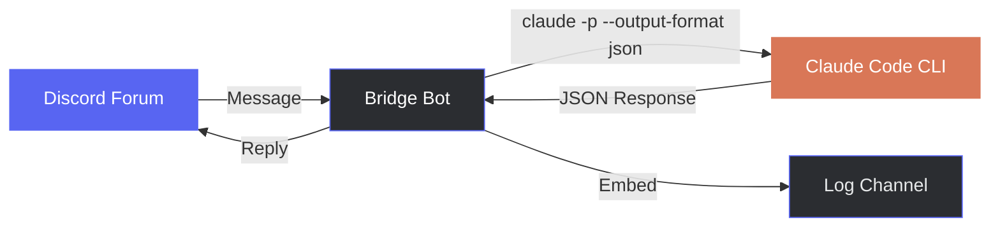
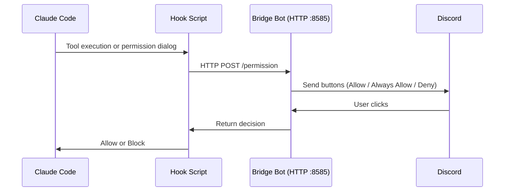

<div align="center">

[日本語](README.md) | **English** | [中文](README_zh.md)

# Discord Claude Bridge

### Discord Forum × Claude Code CLI

[](https://www.python.org/)
[](https://discordpy.readthedocs.io/)
[](https://docs.anthropic.com/en/docs/claude-code)
[](LICENSE)
[](https://www.microsoft.com/windows)

**Turn Discord forum threads into Claude Code conversation sessions.**

---

</div>

## Overview

A bridge bot that executes [Claude Code](https://docs.anthropic.com/en/docs/claude-code) CLI simply by posting in a Discord forum channel. Sessions are managed per thread, maintaining conversation context for continuous interaction.



## Features

| Feature | Description |
|:---:|---|
| **Session Management** | Automatic Claude Code session management per thread. Continues conversations with `--resume` |
| **Discord Permission Approval** | Approve/deny tool executions via Discord buttons before Claude Code runs them |
| **Auto Tag Updates** | `Running` / `Completed` / `Error` tags update in real-time |
| **Execution Logs** | All prompts, responses, and statuses recorded as Embeds in a separate channel |
| **Timeout Control** | Progress notification at 10 min, force kill at 1 hour |
| **Message Splitting** | Auto-splits responses over 2000 chars without breaking code blocks |
| **Access Control** | Only allowed user IDs can execute |

## Requirements

- **Python 3.11+**
- **[Claude Code CLI](https://docs.anthropic.com/en/docs/claude-code)** — `claude` command available in PATH
- **Discord Bot** — Bot token with Message Content Intent enabled

## Quick Start

### 1. Installation

```bash
git clone https://github.com/cUDGk/discord-claude-bridge.git
cd discord-claude-bridge
pip install -r requirements.txt
```

### 2. Configuration

```bash
cp .env.example .env
```

Edit `.env` with the following:

| Variable | Description |
|---|---|
| `DISCORD_TOKEN` | Discord bot token |
| `ALLOWED_USERS` | Allowed user IDs (comma-separated) |
| `FORUM_CHANNEL_ID` | Forum channel ID for receiving prompts |
| `LOG_CHANNEL_ID` | Channel ID for execution logs |
| `GUILD_ID` | Server (guild) ID |
| `SKIP_PERMISSIONS` | Set `true` to auto-allow all operations (default: `false`) |
| `HOOK_PORT` | Internal port for permission requests (default: `8585`) |

### 3. Discord Bot Setup

1. Create a bot at [Discord Developer Portal](https://discord.com/developers/applications)
2. Enable **Message Content Intent** under **Privileged Gateway Intents**
3. Invite the bot with required permissions:
   - `Send Messages` / `Manage Threads` / `Read Message History`
4. Create a forum channel and a text channel for logs

### 4. Start

```bash
python bot.py
```

## Usage

```
1. Create a thread in the forum channel
2. Post a message in the thread
3. The bot executes Claude Code and replies
4. Continue the conversation in the same thread
```

> Thread titles are automatically included as context for new sessions.

## Permission Mode

When `SKIP_PERMISSIONS=false` (default), Discord buttons appear whenever Claude Code attempts to use tools like file editing or command execution.



Two hooks cover all permission checks:

| Hook | Trigger |
|:---:|---|
| **PreToolUse** | Before every tool execution (read-only tools are auto-allowed) |
| **PermissionRequest** | When Claude Code's permission dialog would appear |

| Button | Action |
|:---:|---|
| **Allow** | Allow this tool execution only |
| **Always Allow** | Auto-allow this tool for the rest of the thread |
| **Deny** | Block the tool execution |

> Read-only tools (`Read`, `Glob`, `Grep`, etc.) are automatically allowed.
> The port can be changed with the `HOOK_PORT` environment variable (default: `8585`).

## Security

> **Warning**
> Setting `SKIP_PERMISSIONS=true` will execute all operations **without confirmation**.
>
> - Always limit `ALLOWED_USERS` to trusted users only
> - The bot runs on the host machine, so it has equivalent access rights
> - The default `false` lets you approve/deny each tool via Discord

## License

MIT
