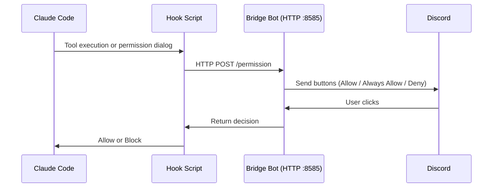

<div align="center">

[日本語](README.md) | **English** | [中文](README_zh.md)

# Discord Claude Bridge

### Discord Forum × Claude Code CLI

[](https://www.python.org/)
[](https://discordpy.readthedocs.io/)
[](https://docs.anthropic.com/en/docs/claude-code)
[](LICENSE)
[](https://www.microsoft.com/windows)

**Turn Discord forum threads into Claude Code conversation sessions.**

---

</div>

## Overview

A bridge bot that executes [Claude Code](https://docs.anthropic.com/en/docs/claude-code) CLI simply by posting in a Discord forum channel. Sessions are managed per thread, maintaining conversation context for continuous interaction.


## Features

| Feature | Description |
|:---:|---|
| **Session Management** | Automatic Claude Code session management per thread. Continues conversations with `--resume` |
| **Session Resume** | Resume PC Claude Code sessions in Discord via slash commands |
| **Auto Working Directory** | Automatically detects and uses the session's working directory (cwd) |
| **Discord Permission Approval** | Approve/deny tool executions via Discord buttons before Claude Code runs them |
| **Image Support** | Send and receive image attachments. Analyze screenshots and more |
| **Auto Tag Updates** | `Running` / `Completed` / `Error` tags update in real-time |
| **Execution Logs** | All prompts, responses, and statuses recorded as Embeds in a separate channel |
| **Timeout Control** | Progress notification at 10 min, force kill at 1 hour |
| **Message Splitting** | Auto-splits responses over 2000 chars without breaking code blocks |
| **Access Control** | Only allowed user IDs can execute |

## Requirements

- **Python 3.11+**
- **[Claude Code CLI](https://docs.anthropic.com/en/docs/claude-code)** — `claude` command available in PATH
- **Discord Bot** — Bot token with Message Content Intent enabled

## Quick Start

### 1. Installation

```bash
git clone https://github.com/cUDGk/discord-claude-bridge.git
cd discord-claude-bridge
pip install -r requirements.txt
```

### 2. Configuration

```bash
cp .env.example .env
```

Edit `.env` with the following:

| Variable | Description |
|---|---|
| `DISCORD_TOKEN` | Discord bot token (required) |
| `ALLOWED_USERS` | Allowed user IDs (comma-separated) |
| `FORUM_CHANNEL_ID` | Forum channel ID for receiving prompts (required) |
| `LOG_CHANNEL_ID` | Channel ID for execution logs (`0` to disable) |
| `GUILD_ID` | Server (guild) ID (`0` for all guilds) |
| `SKIP_PERMISSIONS` | Set `true` to auto-allow all operations (default: `false`) |
| `HOOK_PORT` | Internal port for permission requests (default: `8585`) |
| `CLAUDE_BIN` | `claude` executable name/path (default: `claude`) |
| `PERMISSION_MODE` | `--permission-mode` value (`default` / `acceptEdits` / `plan` / `auto` / `dontAsk` / `bypassPermissions` / empty) |
| `MAX_TURNS` | Max agent turns per request (empty = unlimited) |
| `MAX_BUDGET_USD` | Max USD cost per request (empty = unlimited) |
| `SOFT_TIMEOUT` / `HARD_TIMEOUT` | Progress notification / force-kill seconds (default 600 / 3600) |
| `MAX_CONCURRENT_RUNS` | Max parallel runs across threads (default 5) |

### 3. Discord Bot Setup

1. Create a bot at [Discord Developer Portal](https://discord.com/developers/applications)
2. Enable **Message Content Intent** under **Privileged Gateway Intents**
3. Invite the bot with required permissions:
   - `Send Messages` / `Manage Threads` / `Read Message History` / `Embed Links`
4. Create a forum channel and a text channel for logs

### 4. Start

```bash
python bot.py
```

## Usage

### Basic Usage

```
1. Create a thread in the forum channel
2. Post a message in the thread (image attachments supported)
3. The bot executes Claude Code and replies
4. Continue the conversation in the same thread
```

> Thread titles are automatically included as context for new sessions.

### Slash Commands (`/bridge-*` prefix to avoid collision with Claude Code)

| Command | Description |
|---|---|
| `/bridge-help` | Show commands |
| `/bridge-sessions [count]` | List PC Claude Code sessions (max 20) |
| `/bridge-resume <session_id> [title] [prompt]` | Resume a session in Discord |
| `/bridge-resume-latest [title] [prompt]` | Resume the latest session with one click |

#### Per-thread commands (run inside a bridge forum thread)

| Command | Description |
|---|---|
| `/bridge-info` | Show thread's session ID / cwd / allowed tools / usage |
| `/bridge-forget` | Discard the thread's session; next message starts fresh |
| `/bridge-cancel` | Kill the running claude in this thread |
| `/bridge-retry` | Re-run the last message |
| `/bridge-cwd [path]` | Pin working directory (empty to clear) |
| `/bridge-reset-perms` | Clear "always allow" tools for this thread |
| `/bridge-usage` | Show cumulative tokens / USD cost |
| `/bridge-archive` | Archive this thread |

> Claude Code's own slash commands (`/init` `/clear` `/compact` `/model` `/cost` `/help` etc.) work by sending them as plain message text inside a thread.

### Prefix Commands

| Command | Description |
|---|---|
| `!sync` | Sync slash commands to Discord (run once after adding/changing commands) |

### Live progress

A progress message updates line-by-line as Claude calls tools (TUI-style):

```
🔧 Progress
📖 Read `~/project/src/main.py`
🔎 Grep `pattern` in `src/`
⚡ Bash `npm test`
✏️ Edit `~/project/src/main.py`
```

Edits are rate-limited to once every 1.5 seconds to stay under Discord's limits.

## Permission Mode

When `SKIP_PERMISSIONS=false` (default), Discord buttons appear whenever Claude Code attempts to use tools like file editing or command execution.



Three hooks cover all permission checks and notifications:

| Hook | Trigger |
|:---:|---|
| **PreToolUse** | Before every tool execution. Read-only tools auto-allowed. `AskUserQuestion` becomes choice buttons |
| **PermissionRequest** | When Claude Code's permission dialog would appear |
| **Notification** | Forwards `permission_prompt` / `idle_prompt` / `elicitation_*` events to the thread |

| Button | Action |
|:---:|---|
| **Allow** | Allow this tool execution only |
| **Always Allow** | Auto-allow this tool for the rest of the thread |
| **Deny** | Block the tool execution |

> Read-only tools (`Read`, `Glob`, `Grep`, etc.) are automatically allowed.
> The port can be changed with the `HOOK_PORT` environment variable (default: `8585`).

## Security

> **Warning**
> Setting `SKIP_PERMISSIONS=true` passes `--dangerously-skip-permissions` and executes all operations **without confirmation**.
>
> - Always limit `ALLOWED_USERS` to trusted users only
> - The bot runs on the host machine, so it has equivalent access rights
> - Even with `SKIP_PERMISSIONS=true`, writes to sensitive paths (`.claude/`, `.git/`, `.env`, `.ssh/`, `.vscode/`, `.idea/`, `.husky/`) still require Discord confirmation

## Troubleshooting

| Symptom | Cause / Fix |
|---|---|
| `DISCORD_TOKEN が未設定です` at startup | Copy `.env.example` to `.env` and set `DISCORD_TOKEN` |
| `PrivilegedIntentsRequired` at startup | Enable **Message Content Intent** in the Discord Developer Portal |
| `フックサーバー起動失敗 (port 8585)` | Another process owns the port. Change `HOOK_PORT` |
| Response shows `command not found` | `claude` is not on PATH. Set `CLAUDE_BIN` to an absolute path |
| `/resume <id>` warns "not found locally" | Session file isn't on this machine. Re-sync or use the correct ID |
| Buttons don't respond | 10-min interaction timeout exceeded. Hook auto-allows so Claude keeps running |
| `タイムアウトしました（60分超過）` | Raise `HARD_TIMEOUT` or split the prompt |
| `Discord HTTP エラー: 429` | Rate-limited. Reduce request rate |
| `画像が大きすぎ, スキップ` | Image exceeds Discord's 25MB limit. Shrink the output |

## License

MIT
