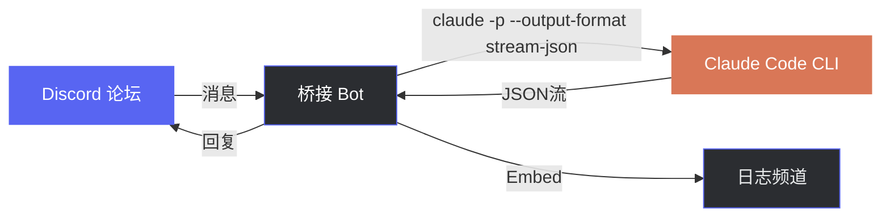
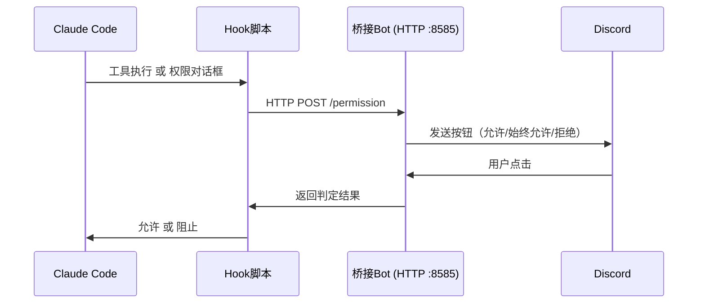

<div align="center">

[日本語](README.md) | [English](README_en.md) | **中文**

# Discord Claude Bridge

### Discord论坛 × Claude Code CLI

[](https://www.python.org/)
[](https://discordpy.readthedocs.io/)
[](https://docs.anthropic.com/en/docs/claude-code)
[](LICENSE)
[](https://www.microsoft.com/windows)

**将Discord论坛主题帖变成Claude Code的对话会话。**

---

</div>

## 概述

只需在Discord论坛频道中发帖，即可在服务器上执行 [Claude Code](https://docs.anthropic.com/en/docs/claude-code) CLI的桥接Bot。每个主题帖独立管理会话，保持对话上下文进行持续交互。



## 功能

| 功能 | 说明 |
|:---:|---|
| **会话管理** | 每个主题帖自动管理Claude Code会话，通过 `--resume` 继续对话 |
| **会话继承** | 通过斜杠命令将PC上的Claude Code会话继承到Discord |
| **工作目录自动解析** | 自动检测并使用会话的工作目录（cwd） |
| **Discord权限审批** | 在Claude Code执行工具前，通过Discord按钮进行允许/拒绝操作 |
| **图片支持** | 支持图片附件的发送和接收，可分析截图等 |
| **标签自动更新** | `运行中` / `已完成` / `错误` 标签实时切换 |
| **执行日志** | 所有提示词、响应和状态以Embed形式记录到专用频道 |
| **超时控制** | 10分钟进度通知，1小时强制终止 |
| **消息分割** | 超过2000字的响应自动分割，不破坏代码块 |
| **访问控制** | 仅允许指定用户ID执行 |

## 环境要求

- **Python 3.11+**
- **[Claude Code CLI](https://docs.anthropic.com/en/docs/claude-code)** — `claude` 命令在PATH中可用
- **Discord Bot** — 已启用Message Content Intent的Bot令牌

## 快速开始

### 1. 安装

```bash
git clone https://github.com/cUDGk/discord-claude-bridge.git
cd discord-claude-bridge
pip install -r requirements.txt
```

### 2. 配置

```bash
cp .env.example .env
```

编辑 `.env` 并设置以下内容：

| 变量名 | 说明 |
|---|---|
| `DISCORD_TOKEN` | Discord Bot令牌（必需） |
| `ALLOWED_USERS` | 允许执行的用户ID（逗号分隔） |
| `FORUM_CHANNEL_ID` | 接收提示词的论坛频道ID（必需） |
| `LOG_CHANNEL_ID` | 执行日志发送频道ID（`0` 表示禁用） |
| `GUILD_ID` | 服务器（公会）ID（`0` 表示所有公会） |
| `SKIP_PERMISSIONS` | 设为 `true` 自动允许所有操作（默认：`false`） |
| `HOOK_PORT` | 权限请求内部端口（默认：`8585`） |
| `CLAUDE_BIN` | `claude` 可执行文件名/路径（默认：`claude`） |
| `PERMISSION_MODE` | `--permission-mode` 值（`acceptEdits` / `plan` / `auto` / `bypassPermissions` / 空） |
| `MAX_TURNS` | 单次请求最大代理回合数（空 = 无限制） |
| `MAX_BUDGET_USD` | 单次请求最大费用美元（空 = 无限制） |
| `SOFT_TIMEOUT` / `HARD_TIMEOUT` | 进度通知 / 强制终止秒数（默认 600 / 3600） |
| `MAX_CONCURRENT_RUNS` | 跨主题帖并行执行上限（默认 5） |

### 3. Discord Bot设置

1. 在 [Discord Developer Portal](https://discord.com/developers/applications) 创建Bot
2. 在 **Privileged Gateway Intents** 中启用 **Message Content Intent**
3. 使用所需权限邀请Bot：
   - `Send Messages` / `Manage Threads` / `Read Message History` / `Embed Links`
4. 创建论坛频道和日志文本频道

### 4. 启动

```bash
python bot.py
```

## 使用方法

### 基本用法

```
1. 在论坛频道创建主题帖
2. 在主题帖中发送消息（支持图片附件）
3. Bot执行Claude Code并回复
4. 在同一主题帖中继续对话
```

> 主题帖标题会自动作为新会话的上下文附加。

### 斜杠命令 (`/bridge-*` 前缀以避免与 Claude Code 冲突)

| 命令 | 说明 |
|---|---|
| `/bridge-help` | 显示命令列表 |
| `/bridge-sessions [数量]` | PC Claude Code 会话列表（最多20） |
| `/bridge-resume <session_id> [title] [prompt]` | 将指定会话继承到Discord |
| `/bridge-resume-latest [title] [prompt]` | 一键继承最新会话 |

#### 主题帖内命令 (在 bridge 论坛主题帖中执行)

| 命令 | 说明 |
|---|---|
| `/bridge-info` | 显示主题帖的会话ID / cwd / 允许工具 / 使用量 |
| `/bridge-forget` | 丢弃本主题帖的会话，下条消息开始新会话 |
| `/bridge-cancel` | 杀掉本主题帖运行中的 claude |
| `/bridge-retry` | 重新执行上一条消息 |
| `/bridge-cwd [path]` | 固定工作目录（空清除） |
| `/bridge-reset-perms` | 清除「始终允许」的工具列表 |
| `/bridge-usage` | 累计 token / 美元费用 |
| `/bridge-archive` | 归档本主题帖 |

> Claude Code 自身的斜杠命令 (`/init` `/clear` `/compact` `/model` `/cost` `/help` 等) 直接作为消息文本发送即可。

### 前缀命令

| 命令 | 说明 |
|---|---|
| `!sync` | 将斜杠命令同步到Discord（添加/修改命令后执行一次） |

### 实时进度

Claude 调用工具时，进度消息会逐行更新 (TUI 风格):

```
🔧 进度
📖 Read `~/project/src/main.py`
🔎 Grep `pattern` in `src/`
⚡ Bash `npm test`
✏️ Edit `~/project/src/main.py`
```

编辑被限制为最多每 1.5 秒一次，以避免 Discord 速率限制。

## 权限模式

当 `SKIP_PERMISSIONS=false`（默认）时，Claude Code尝试使用文件编辑或命令执行等工具时，Discord主题帖中会显示按钮。



三个钩子覆盖所有权限确认和通知：

| 钩子 | 触发时机 |
|:---:|---|
| **PreToolUse** | 所有工具执行前。只读工具自动允许。`AskUserQuestion` 转为选项按钮 |
| **PermissionRequest** | Claude Code权限确认对话框显示时 |
| **Notification** | 将 `permission_prompt` / `idle_prompt` / `elicitation_*` 等通知转发到相应主题帖 |

| 按钮 | 操作 |
|:---:|---|
| **允许** | 仅允许本次工具执行 |
| **始终允许** | 在该主题帖内自动允许同一工具 |
| **拒绝** | 阻止工具执行 |

> 只读工具（`Read`、`Glob`、`Grep` 等）自动允许。
> 端口可通过 `HOOK_PORT` 环境变量更改（默认：`8585`）。

## 安全性

> **警告**
> 设置 `SKIP_PERMISSIONS=true` 会传递 `--dangerously-skip-permissions`，**不经确认**执行所有操作。
>
> - 务必将 `ALLOWED_USERS` 限制为可信用户
> - Bot在主机上运行，因此具有与主机相同的访问权限
> - 即使 `SKIP_PERMISSIONS=true`，对敏感路径（`.claude/`、`.git/`、`.env`、`.ssh/`、`.vscode/`、`.idea/`、`.husky/`）的写入仍需 Discord 按钮确认

## 故障排除

| 症状 | 原因 / 解决方法 |
|---|---|
| 启动时 `DISCORD_TOKEN が未設定です` | 复制 `.env.example` 到 `.env` 并填入 `DISCORD_TOKEN` |
| 启动时 `PrivilegedIntentsRequired` | 在 Discord Developer Portal 启用 **Message Content Intent** |
| 启动时 `フックサーバー起動失敗 (port 8585)` | 端口被占用。修改 `HOOK_PORT` |
| 响应显示 `command not found` | `claude` 不在 PATH 中。`CLAUDE_BIN` 设置绝对路径 |
| `/resume <id>` 提示「未在本地找到」 | 会话文件不在此机器上。重新同步或使用正确 ID |
| 按钮无反应 | 超过 10 分钟交互超时。钩子自动允许，Claude 继续运行 |
| `タイムアウトしました（60分超過）` | 增大 `HARD_TIMEOUT` 或拆分提示词 |
| `Discord HTTP エラー: 429` | 速率限制。减少请求频率 |
| `画像が大きすぎ, スキップ` | 图片超过 Discord 25MB 限制。缩小输出 |

## 许可证

MIT
